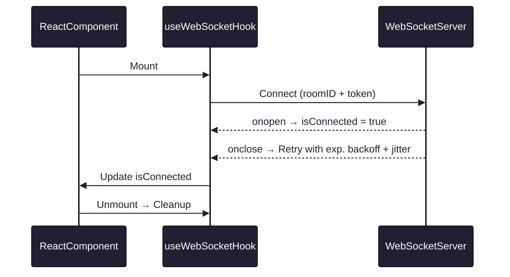

```
███████  █████  ██ ███████ ███████ ██      ██████  ██ ███    ██ 
██      ██   ██ ██ ██      ██      ██      ██   ██ ██ ████   ██ 
███████ ███████ ██ █████   █████   ██      ██   ██ ██ ██ ██  ██ 
     ██ ██   ██ ██ ██      ██      ██      ██   ██ ██ ██  ██ ██ 
███████ ██   ██ ██ ██      ███████ ███████ ██████  ██ ██   ████ 
                                                                
```
# useWebSocket — The React WebSocket Hook

[](#)
[](#)
[](#)
[](#)
[](#)

---

> **Purpose:**  
> `useWebSocket` is a **production-grade**, **offline-aware**, and **self-healing** WebSocket hook for React applications.  
> Built for **real-time messaging**, **live dashboards**, and **mission-critical connections** — it keeps you connected, no matter how bad the network.

---

## ✨ Features

- 🚀 **Exponential Backoff + Jitter** — Prevents reconnect storms under server restarts.
- 🌐 **Offline Detection** — Pauses retries while offline, resumes instantly on reconnect.
- 🛡 **Secure Token Handling** — Designed to work with short-lived, encrypted tokens.
- ♻ **Lifecycle-Safe** — No memory leaks, no ghost listeners.
- ⚡ **Ultra Lightweight** — No dependencies, no bloat.

---

## 📦 Installation
```bash
# Just copy it — own your code
src/hooks/useWebSocket.ts
```

---

## 🚀 Quick Start

```tsx
import useWebSocket from "./useWebSocket";

export default function ChatRoom({ roomID }: { roomID: number }) {
  const { ws, isConnected } = useWebSocket({ log: true, roomID });

  return (
    <div>
      <p>Status: {isConnected ? "🟢 Connected" : "🔴 Disconnected"}</p>
      <button
        onClick={() => ws?.send(JSON.stringify({ type: "message", content: "Hello!" }))}
        disabled={!isConnected}
      >
        Send
      </button>
    </div>
  );
}
```

---

## ⚙️ API Reference

### **`useWebSocket(options)`**

**Parameters**

| Name     | Type    | Required | Description                        |
| -------- | ------- | -------- | ---------------------------------- |
| `log`    | boolean | ✅        | Enables verbose debug logging.     |
| `roomID` | number  | ✅        | ID of the chat room to connect to. |

**Returns**

| Name          | Type                | Description                                        |
| ------------- | ------------------- | -------------------------------------------------- |
| `ws`          | `WebSocket \| null` | The WebSocket instance or `null` if not connected. |
| `isConnected` | `boolean`           | Real-time connection status.                       |

---

## 🔄 Connection Lifecycle



---

## 📡 Reconnection Logic

* **Initial Delay:** `1000ms`
* **Max Delay:** `30000ms`
* **Backoff:** Delay × 2 each retry
* **Jitter:** + `0–500ms` random spread

**Example sequence:**
`1s → 2s → 4s → 8s → 16s → 30s (cap)`

---

## 🌐 Offline Awareness

* Detects **`window.offline`** event → closes connection, pauses retries.
* Detects **`window.online`** event → resets delay to `1000ms`, reconnects immediately.

---

## 🧹 Cleanup & Stability

* Fully cleans event listeners on unmount.
* Prevents "zombie sockets" from consuming memory.
* No duplicate event handlers.

---

## 🛠 Advanced Example

```tsx
useEffect(() => {
  if (!ws) return;
  ws.onmessage = (event) => {
    const data = JSON.parse(event.data);
    console.log("📩 Incoming:", data);
  };
}, [ws]);
```

---

## 📜 License

MIT © 2025 — Built for developers who demand **zero compromise** in reliability.
